# Service Documentation: CustomerService:CMR_GetCustomerByID

## Purpose

Retrieves a customer record from the Customer Management API by ID. Issues an HTTP GET to `http://localhost:5001/customers/{customer_id}`, converts the response bytes to a UTF-8 string, and — on HTTP 200 — parses the JSON body and maps `first_name`, `last_name`, `email`, and `status` to the service output pipeline. Returns a descriptive `errorMessage` for HTTP 404, any other non-200 status code, or a network-level exception, clearing all data fields in every non-success path.

---

## Service Signature

### Inputs

| Parameter | Type | Constraints | Description |
|---|---|---|---|
| `customer_id` | `String` | — | Unique identifier of the customer to retrieve. Appended directly to the base URL to form the full request path. |

### Outputs

| Parameter | Type | Description |
|---|---|---|
| `name` | `String` | Full display name assembled by concatenating `first_name`, a space, and `last_name` from the API JSON response. Empty string on any error. |
| `email` | `String` | Customer email address from the `email` field of the JSON response. Empty string on any error. |
| `accountStatus` | `String` | Current account state from the `status` field of the JSON response (e.g. `active`, `suspended`). Empty string on any error. |
| `errorMessage` | `String` | Human-readable error description. Empty string on success. `"Customer not found"` on HTTP 404. `"Customer API unavailable"` on any other HTTP status or network exception. |

---

## Flow Diagram

```mermaid
flowchart TD
    %% Styling
    classDef startEnd  fill:#e8f5e9,stroke:#388e3c,color:#1b5e20
    classDef mapStep   fill:#e3f2fd,stroke:#1976d2,color:#0d47a1
    classDef invoke    fill:#e8eaf6,stroke:#3949ab,color:#1a237e
    classDef decision  fill:#fff9c4,stroke:#f9a825,color:#4e342e
    classDef tryBlock  fill:#fce4ec,stroke:#c62828,color:#b71c1c

    %% Start
    A([Start: CMR_GetCustomerByID]):::startEnd

    %% Step 1: Build URL
    A --> B[INVOKE pub.string:concat -- base URL + customer_id -> fullUrl]:::invoke

    %% TRY entry
    B --> C[TRY block begin]:::tryBlock

    subgraph TRY["TRY"]
        D[INVOKE pub.client:http -- GET /customers/&#123;customer_id&#125;]:::invoke
        E[MAP: header/status -> httpStatus]:::mapStep
        F[INVOKE pub.string:bytesToString -- body/bytes UTF-8 -> responseString]:::invoke
        G{IF: httpStatus == 200?}:::decision
        D --> E --> F --> G

        subgraph IF_BLOCK["IF: httpStatus == '200'"]
            H[INVOKE pub.json:jsonStringToDocument -- responseString -> responseDoc]:::invoke
            I[INVOKE pub.string:concat -- first_name + space -> firstName]:::invoke
            J[INVOKE pub.string:concat -- firstName + last_name -> name]:::invoke
            K[MAP: set email, accountStatus from responseDoc / errorMessage = empty]:::mapStep
            H --> I --> J --> K
        end

        subgraph ELSEIF_BLOCK["ELSEIF: httpStatus == '404'"]
            L[MAP: clear name, email, accountStatus / errorMessage = Customer not found]:::mapStep
        end

        subgraph ELSE_BLOCK["ELSE: any other status"]
            M[MAP: clear name, email, accountStatus / errorMessage = Customer API unavailable]:::mapStep
        end
    end

    subgraph CATCH["CATCH: exception"]
        N[MAP: clear name, email, accountStatus / errorMessage = Customer API unavailable]:::tryBlock
    end

    %% Branch routing
    C --> D
    G -->|httpStatus == 200| H
    G -->|httpStatus == 404| L
    G -->|other| M

    %% Convergence
    K --> P[End of TRY]:::tryBlock
    L --> P
    M --> P

    %% Exception arc
    C -.->|exception| N

    %% End
    P --> Z([End: return name, email, accountStatus, errorMessage]):::startEnd
    N --> Z
```

---

## Usage Examples

### Example 1 — Active customer (HTTP 200)

**Input:**
| Parameter | Value |
|---|---|
| `customer_id` | `"CUST-001"` |

**Output:**
| Parameter | Value |
|---|---|
| `name` | `"John Smith"` |
| `email` | `"john.smith@example.com"` |
| `accountStatus` | `"active"` |
| `errorMessage` | `""` |

---

### Example 2 — Customer not found (HTTP 404)

**Input:**
| Parameter | Value |
|---|---|
| `customer_id` | `"CUST-UNKNOWN"` |

**Output:**
| Parameter | Value |
|---|---|
| `name` | `""` |
| `email` | `""` |
| `accountStatus` | `""` |
| `errorMessage` | `"Customer not found"` |

---

### Example 3 — API unavailable (5xx or network exception)

**Input:**
| Parameter | Value |
|---|---|
| `customer_id` | `"CUST-001"` |

**Output:**
| Parameter | Value |
|---|---|
| `name` | `""` |
| `email` | `""` |
| `accountStatus` | `""` |
| `errorMessage` | `"Customer API unavailable"` |

---

## Implementation Details

The service operates in three phases:

1. **URL Construction** — `pub.string:concat` combines the hardcoded base `http://localhost:5001/customers/` with `customer_id` to produce `fullUrl`.

2. **HTTP Execution and Status Routing (TRY block)** — `pub.client:http` issues the GET. A MAP step extracts `header/status` into the flat variable `httpStatus` using `set (variable)` substitution (slash-paths are invalid in `IF` condition tokens). `pub.string:bytesToString` decodes `body/bytes` (typed as `Object` at runtime per BP-004) to a UTF-8 `responseString`. An `IF/ELSEIF/ELSE` chain routes:
   - **200** → `pub.json:jsonStringToDocument` parses body into `responseDoc`; two `pub.string:concat` calls build `name`; a MAP extracts `email` and `status` via `set (variable)`.
   - **404** → all data fields cleared, `errorMessage = "Customer not found"`.
   - **other** → all data fields cleared, `errorMessage = "Customer API unavailable"`.

3. **Exception Handling (CATCH)** — any exception (host unreachable, timeout, SSL) clears all data fields and sets `errorMessage = "Customer API unavailable"`, ensuring a clean, predictable output structure in every case.

---

## Error Handling

| Condition | Branch | `errorMessage` |
|---|---|---|
| HTTP 200 | TRY → IF | `""` |
| HTTP 404 | TRY → ELSEIF | `"Customer not found"` |
| HTTP 5xx or other non-200/404 | TRY → ELSE | `"Customer API unavailable"` |
| Network exception / host unreachable | CATCH | `"Customer API unavailable"` |

All data output fields (`name`, `email`, `accountStatus`) are explicitly set to empty string in every non-200 path — callers never receive partial or stale pipeline values.

---

## Related Services

| Service | Purpose |
|---|---|
| `pub.string:concat` | Concatenates two strings — used both to build the request URL and to assemble the full customer name |
| `pub.client:http` | Issues the outbound HTTP GET and returns response header and body |
| `pub.string:bytesToString` | Decodes raw response `body/bytes` (Object) to a UTF-8 string |
| `pub.json:jsonStringToDocument` | Parses the JSON response string into a structured pipeline document (`responseDoc`) |

---

## Notes

- **Package:** `CMR` (Customer Management and Retrieval)
- **Namespace:** `CustomerService`
- **Flow file:** `fetchCustomer.flow`
- The Customer API base URL `http://localhost:5001` is hardcoded in the `pub.string:concat` input. Update this literal when deploying to non-local environments (dev, staging, prod).
- `body/bytes` is mapped as `Object` (not `Byte[]`) in the `pub.string:bytesToString` call — this matches the actual IS runtime type returned by `pub.client:http` (BP-004).
- Two sequential `pub.string:concat` calls are required to build the full name because the service accepts only two string inputs at a time: first `first_name + " "`, then that result + `last_name`.
- `httpStatus` is extracted via a MAP with `copy header/status -> httpStatus` before the `IF` condition because the FSL `SUBSTITUTION_VAR` token (`%...%`) does not support slash-delimited paths.
