# Service Documentation: CustomerService:customerService_GetCustomerByID

## Purpose

Retrieves a customer record from the Customer API by ID. Issues an HTTP GET request to `http://localhost:5001/customers/{customer_id}`, parses the JSON response, and maps the customer's full name, email address, and account status to the service output pipeline. Returns a descriptive `errorMessage` on any failure — including 404 Not Found, unexpected HTTP status codes, and network-level exceptions — while clearing all data output fields.

---

## Service Signature

### Inputs

| Parameter | Type | Constraints | Description |
|---|---|---|---|
| `customer_id` | `String` | — | The unique identifier of the customer to retrieve. Appended directly to the base URL path to construct the final request URL. |

### Outputs

| Parameter | Type | Description |
|---|---|---|
| `name` | `String` | The customer's full display name, assembled by concatenating `first_name`, a space character, and `last_name` from the API JSON response. Empty string on any error. |
| `email` | `String` | The customer's email address as returned in the JSON response `email` field. Empty string on any error. |
| `accountStatus` | `String` | The customer's current account state as returned in the JSON response `status` field (e.g. `active`, `suspended`). Empty string on any error. |
| `errorMessage` | `String` | Human-readable error description. Empty string on success. `"Customer not found"` on HTTP 404. `"Customer API unavailable"` on any other non-200 HTTP status or on a network exception. |

---

## Flow Diagram

```mermaid
flowchart TD
    %% Styling
    classDef startEnd  fill:#e8f5e9,stroke:#388e3c,color:#1b5e20
    classDef mapStep   fill:#e3f2fd,stroke:#1976d2,color:#0d47a1
    classDef invoke    fill:#e8eaf6,stroke:#3949ab,color:#1a237e
    classDef decision  fill:#fff9c4,stroke:#f9a825,color:#4e342e
    classDef tryBlock  fill:#fce4ec,stroke:#c62828,color:#b71c1c
    classDef exitStep  fill:#f3e5f5,stroke:#7b1fa2,color:#4a148c

    %% Start
    A([Start: customerService_GetCustomerByID]):::startEnd

    %% Step 1 — Build URL
    A --> B[INVOKE pub.string:concat -- build URL: base + customer_id]:::invoke

    %% TRY entry
    B --> TRY_ENTRY[TRY block begin]:::tryBlock

    subgraph TRY["TRY"]
        %% HTTP call
        C[INVOKE pub.client:http -- GET /customers/&#123;customer_id&#125;]:::invoke
        %% Extract status
        D[MAP: extract header/status -> httpStatus]:::mapStep
        %% Decode body
        E[INVOKE pub.string:bytesToString -- encoding UTF-8 -> responseString]:::invoke
        %% Branch condition
        F{IF: httpStatus == 200?}:::decision

        C --> D --> E --> F

        subgraph IF_BLOCK["IF: httpStatus == '200'"]
            G[INVOKE pub.json:jsonStringToDocument -- responseString -> responseDoc]:::invoke
            H[INVOKE pub.string:concat -- first_name + space -> firstName]:::invoke
            I[INVOKE pub.string:concat -- firstName + last_name -> name]:::invoke
            J[MAP: set email, accountStatus from responseDoc / set errorMessage = empty]:::mapStep
            G --> H --> I --> J
        end

        subgraph ELSEIF_BLOCK["ELSEIF: httpStatus == '404'"]
            K[MAP: clear name, email, accountStatus / set errorMessage = Customer not found]:::mapStep
        end

        subgraph ELSE_BLOCK["ELSE: any other status"]
            L[MAP: clear name, email, accountStatus / set errorMessage = Customer API unavailable]:::mapStep
        end
    end

    subgraph CATCH["CATCH: exception"]
        M[MAP: clear name, email, accountStatus / set errorMessage = Customer API unavailable]:::tryBlock
    end

    %% Edges from TRY_ENTRY into TRY body
    TRY_ENTRY --> C

    %% Branch routing
    F -->|httpStatus == 200| G
    F -->|httpStatus == 404| K
    F -->|other status| L

    %% Convergence to CATCH boundary
    J --> CONV[End of TRY]:::tryBlock
    K --> CONV
    L --> CONV

    %% CATCH fires on exception only
    TRY_ENTRY -.->|exception thrown| M

    %% End
    CONV --> Z([End: return name, email, accountStatus, errorMessage]):::startEnd
    M --> Z
```

---

## Usage Examples

### Example 1 — Active customer found (HTTP 200)

**Input:**
| Parameter | Value |
|---|---|
| `customer_id` | `"CUST-001"` |

**Output:**
| Parameter | Value |
|---|---|
| `name` | `"John Smith"` |
| `email` | `"john.smith@example.com"` |
| `accountStatus` | `"active"` |
| `errorMessage` | `""` |

---

### Example 2 — Customer not found (HTTP 404)

**Input:**
| Parameter | Value |
|---|---|
| `customer_id` | `"CUST-UNKNOWN"` |

**Output:**
| Parameter | Value |
|---|---|
| `name` | `""` |
| `email` | `""` |
| `accountStatus` | `""` |
| `errorMessage` | `"Customer not found"` |

---

### Example 3 — API unavailable (network exception or 5xx)

**Input:**
| Parameter | Value |
|---|---|
| `customer_id` | `"CUST-001"` |

**Output:**
| Parameter | Value |
|---|---|
| `name` | `""` |
| `email` | `""` |
| `accountStatus` | `""` |
| `errorMessage` | `"Customer API unavailable"` |

---

## Implementation Details

The service operates in three distinct phases:

1. **URL Construction** — `pub.string:concat` assembles the full request URL by concatenating the hardcoded base path `http://localhost:5001/customers/` with the `customer_id` input.

2. **HTTP Execution & Status Routing (TRY block)** — `pub.client:http` issues the GET request. The `header/status` field is extracted into the flat pipeline variable `httpStatus` via a MAP step using `set (variable)` substitution (required because slash-paths cannot be used directly in `IF` conditions). `pub.string:bytesToString` converts the response `body/bytes` (`Object` type at runtime per BP-004) to a UTF-8 string. An `IF/ELSEIF/ELSE` chain then routes on `httpStatus`:
   - **200** — `pub.json:jsonStringToDocument` parses the body into `responseDoc`. Two sequential `pub.string:concat` calls build the full name (`first_name + " " + last_name`). A final MAP extracts `email` and `status` from `responseDoc` using `set (variable)` substitution.
   - **404** — All data fields are cleared and `errorMessage` is set to `"Customer not found"`.
   - **Any other code** — All data fields are cleared and `errorMessage` is set to `"Customer API unavailable"`.

3. **Exception Handling (CATCH block)** — If `pub.client:http` throws (e.g. host unreachable, connection refused, SSL failure), the CATCH block clears all data fields and sets `errorMessage` to `"Customer API unavailable"`, ensuring the service always returns a clean, predictable output structure to the caller.

---

## Error Handling

| Condition | Branch | `errorMessage` value |
|---|---|---|
| HTTP 200 | TRY → IF | `""` (empty) |
| HTTP 404 | TRY → ELSEIF | `"Customer not found"` |
| Any other HTTP status (e.g. 500, 503) | TRY → ELSE | `"Customer API unavailable"` |
| Network exception / host unreachable | CATCH | `"Customer API unavailable"` |

All data output fields (`name`, `email`, `accountStatus`) are explicitly set to empty string in every non-200 path. This guarantees callers never receive a partial or stale pipeline value.

---

## Related Services

| Service | Purpose |
|---|---|
| `pub.string:concat` | Concatenates two strings — used to build the request URL and to assemble first_name + last_name |
| `pub.client:http` | Issues the outbound HTTP GET request and returns the response header and body |
| `pub.string:bytesToString` | Converts the raw response `body/bytes` to a UTF-8 String for JSON parsing |
| `pub.json:jsonStringToDocument` | Parses the JSON response string into a structured pipeline document (`responseDoc`) |

---

## Notes

- The Customer API is expected at `http://localhost:5001`. Update the base URL string in the `pub.string:concat` input block when deploying to non-local environments.
- `body/bytes` is typed as `Object` in the `pub.string:bytesToString` mapping (not `Byte[]`). This matches the actual IS runtime type returned by `pub.client:http` and avoids a parse error.
- The name assembly requires **two** `concat` calls because `pub.string:concat` only accepts two strings at a time: first `first_name + " "`, then that result + `last_name`.
- The `httpStatus` extraction uses `set (variable)` with the path `%header/status%` because slash-delimited paths are not valid inside `IF` condition `%...%` substitution tokens.
